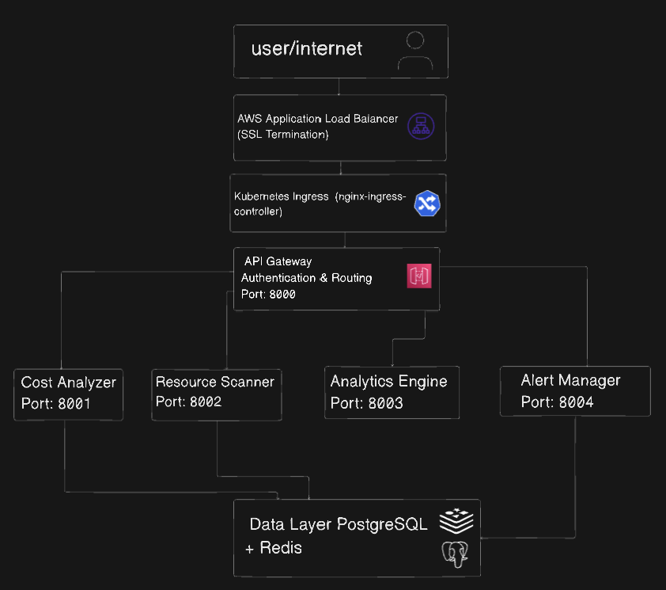

# CostWatch Architecture Documentation

## System Architecture Overview

CostWatch implements a modern microservices architecture designed for scalability, maintainability, and high availability. The system follows cloud-native principles with container-based deployment and infrastructure as code.

## High-Level Architecture





## Microservices Design

### 1. API Gateway Service

**Responsibilities:**
- Request routing and load balancing
- Authentication and authorization
- Rate limiting and throttling
- Request/response transformation
- API versioning management

**Technology Stack:**
- FastAPI with async/await
- JWT token validation
- Redis for session management
- Prometheus metrics integration

**Key Components:**
```python
# Authentication middleware
app/middleware/auth.py
- JWT token validation
- Role-based access control
- Session management

# Routing logic
app/routes/
- auth.py: Authentication endpoints
- costs.py: Cost analysis routing
- health.py: Health check endpoints

# Service client
app/utils/service_client.py
- HTTP client for microservice communication
- Circuit breaker implementation
- Request retry logic
```

### 2. Cost Analyzer Service

**Responsibilities:**
- AWS Cost Explorer API integration
- Cost data processing and aggregation
- Trend analysis and pattern recognition
- Budget tracking and variance analysis
- Cost optimization calculations

**Data Processing Pipeline:**
```
AWS Cost Explorer API → Raw Cost Data → Processing Engine → 
Trend Analysis → Cost Metrics → Database Storage
```

**Key Algorithms:**
- Moving average trend calculation
- Seasonal decomposition for cost patterns
- Variance analysis for budget tracking
- Cost attribution algorithms

### 3. Resource Scanner Service

**Responsibilities:**
- AWS resource discovery across multiple regions
- Resource metadata collection and enrichment
- Cost tagging and categorization
- Resource lifecycle tracking
- Inventory management

**Scanning Strategy:**
```python
# Scan orchestration
services/
- aws_scanner.py: Main orchestration
- ec2_scanner.py: EC2 instance discovery
- rds_scanner.py: RDS instance discovery
- s3_scanner.py: S3 bucket analysis

# Scan frequency
- Full scan: Every 6 hours
- Incremental scan: Every 15 minutes
- Critical resources: Every 5 minutes
```

### 4. Analytics Engine Service

**Responsibilities:**
- Machine learning model training and inference
- Predictive cost forecasting
- Anomaly detection algorithms
- Report generation and scheduling
- Statistical analysis

**ML Pipeline:**
```
Historical Data → Feature Engineering → Model Training → 
Validation → Deployment → Inference → Predictions
```

**Models Implemented:**
- ARIMA for time series forecasting
- Isolation Forest for anomaly detection
- Linear regression for trend analysis
- Clustering for usage pattern recognition

### 5. Alert Manager Service

**Responsibilities:**
- Real-time threshold monitoring
- Alert rule evaluation
- Multi-channel notification delivery
- Alert lifecycle management
- Escalation and acknowledgment handling

**Alert Processing Pipeline:**
```
Metrics Collection → Rule Evaluation → Alert Triggering → 
Notification Routing → Delivery Tracking → Status Updates
```

## Data Architecture

### Database Design

**PostgreSQL Schema Structure:**
```sql
-- Core entities
organizations      # Multi-tenant organization data
users             # User accounts and roles
aws_accounts      # AWS account configurations

-- Resource tracking
aws_resources     # Discovered AWS resources
cost_data        # Historical cost information
resource_usage_metrics  # Performance metrics

-- Analytics
cost_forecasts   # ML-generated predictions
cost_anomalies   # Detected anomalies
optimization_recommendations  # AI suggestions

-- Alerting
alert_rules      # Alert configurations
alerts          # Alert instances
alert_notifications  # Delivery tracking
```

**Data Partitioning Strategy:**
- Time-based partitioning for cost_data table
- Hash partitioning for multi-tenant isolation
- Automated partition management with retention policies

### Caching Strategy

**Redis Cache Layers:**

**L1: Application Cache (5 minutes TTL)**
- Frequently accessed cost summaries
- User session data
- API response caching

**L2: Computation Cache (1 hour TTL)**
- Complex analytics results
- ML model outputs
- Report generation cache

**L3: Reference Data Cache (24 hours TTL)**
- AWS service pricing data
- Resource metadata
- Configuration settings

## Security Architecture

### Authentication & Authorization

**Multi-layer Security:**
```
Internet → WAF → Load Balancer → Ingress → API Gateway → Services
```

**Security Components:**
- JWT-based authentication with refresh tokens
- Role-based access control (RBAC)
- API key management for service-to-service communication
- Network policies for pod-to-pod communication
- Secrets management with Kubernetes secrets

### Data Protection

**Encryption:**
- TLS 1.3 for data in transit
- AES-256 encryption for data at rest
- AWS KMS for key management
- Database-level encryption for sensitive fields

**Compliance:**
- SOC 2 Type II controls
- GDPR compliance for user data
- Audit logging for all data access
- Data retention policies

## Infrastructure Architecture

### Kubernetes Deployment

**Cluster Architecture:**
```
AWS EKS Cluster
├── System Namespace
│   ├── nginx-ingress-controller
│   ├── aws-load-balancer-controller
│   ├── cluster-autoscaler
│   └── cert-manager
├── Monitoring Namespace
│   ├── prometheus
│   ├── grafana
│   ├── alertmanager
│   └── node-exporter
└── Application Namespace (costwatch)
    ├── api-gateway (2 replicas)
    ├── cost-analyzer (2 replicas)
    ├── resource-scanner (1 replica)
    ├── analytics-engine (2 replicas)
    ├── alert-manager (2 replicas)
    └── redis (1 replica)
```

**Resource Allocation:**

| Service | CPU Request | Memory Request | CPU Limit | Memory Limit |
|---------|-------------|----------------|-----------|--------------|
| API Gateway | 250m | 256Mi | 500m | 512Mi |
| Cost Analyzer | 500m | 512Mi | 1000m | 1Gi |
| Resource Scanner | 250m | 256Mi | 500m | 512Mi |
| Analytics Engine | 500m | 512Mi | 1000m | 1Gi |
| Alert Manager | 100m | 128Mi | 200m | 256Mi |

### Auto-scaling Configuration

**Horizontal Pod Autoscaler:**
```yaml
# Example HPA configuration
apiVersion: autoscaling/v2
kind: HorizontalPodAutoscaler
spec:
  minReplicas: 2
  maxReplicas: 10
  metrics:
  - type: Resource
    resource:
      name: cpu
      target:
        type: Utilization
        averageUtilization: 70
  - type: Resource
    resource:
      name: memory
      target:
        type: Utilization
        averageUtilization: 80
```

**Cluster Autoscaler:**
- Node groups scale from 2 to 20 nodes
- Mixed instance types for cost optimization
- Spot instances for non-critical workloads

## Monitoring and Observability

### Metrics Collection

**Application Metrics:**
- Request rate, latency, and error rates
- Business metrics (costs analyzed, recommendations generated)
- Resource utilization and performance metrics
- Custom metrics for cost optimization tracking

**Infrastructure Metrics:**
- Kubernetes cluster health and resource usage
- Database performance and connection pools
- Cache hit rates and response times
- Network traffic and security events

### Logging Strategy

**Structured Logging:**
```json
{
  "timestamp": "2024-01-15T10:30:00Z",
  "service": "cost-analyzer",
  "level": "INFO",
  "message": "Cost analysis completed",
  "request_id": "uuid",
  "user_id": "uuid",
  "duration_ms": 1250,
  "resources_analyzed": 142
}
```

**Log Aggregation:**
- Centralized logging with ELK stack
- Log retention policies by environment
- Real-time log monitoring and alerting
- Security event correlation

### Distributed Tracing

**Request Tracing:**
- OpenTelemetry integration
- Cross-service request tracking
- Performance bottleneck identification
- Error propagation analysis

## Performance Considerations

### Scalability Patterns

**Horizontal Scaling:**
- Stateless service design
- Database connection pooling
- Cache-aside pattern implementation
- Asynchronous processing for heavy operations

**Performance Optimization:**
- Database query optimization with proper indexing
- Redis caching for frequently accessed data
- CDN for static asset delivery
- Connection pooling and keep-alive configurations

### Load Testing Results

**Performance Benchmarks:**
- API Gateway: 1000 requests/second sustained
- Cost analysis: 100 concurrent analyses
- Resource scanning: 10,000 resources/minute
- Report generation: 50 concurrent reports

## Disaster Recovery

### Backup Strategy

**Database Backups:**
- Automated daily backups with 30-day retention
- Point-in-time recovery capability
- Cross-region backup replication
- Backup integrity verification

**Configuration Backups:**
- Infrastructure as Code in version control
- Kubernetes manifests versioned and stored
- Secret rotation and backup procedures
- Disaster recovery runbooks

### High Availability

**Multi-AZ Deployment:**
- Database with Multi-AZ configuration
- Application pods distributed across AZs
- Load balancer health checks and failover
- DNS failover with Route 53

---

This architecture documentation provides a comprehensive view of the CostWatch platform's design, implementation, and operational considerations.